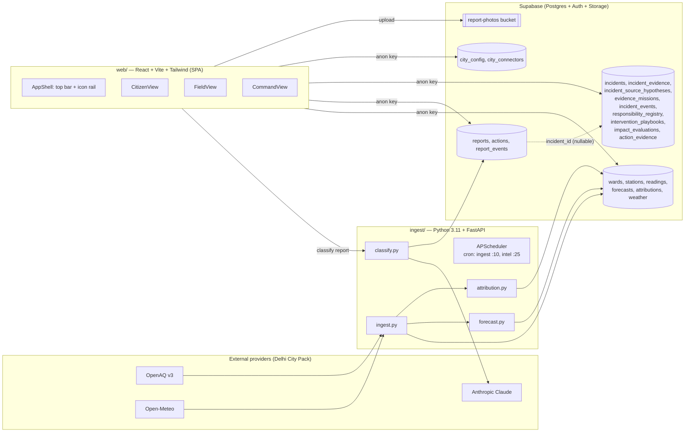

# Vayu Gati — Architecture

Status: reflects the codebase through Phase 11 (Delhi pilot validation,
historical replay, end-to-end scenario testing and pilot readiness
sign-off). No new architectural component was added this phase — Phase 11
validated the existing architecture against real historical Delhi data and
deterministic scenarios rather than changing it. Two genuinely new,
narrow additions: `ingest/scripts/historical_replay.py` /
`forecast_replay.py` (offline validation drivers, not part of the running
service — they call the same `run_anomaly_detection`/`forecast.py`
functions the live system uses, against an isolated replay city, never a
new code path in production), and one index-only migration
(`20260726000000_pilot_validation_performance.sql`). See
[IMPLEMENTATION_STATUS.md](IMPLEMENTATION_STATUS.md) for what is live vs.
scaffolded, and [PILOT_READINESS_REPORT.md](PILOT_READINESS_REPORT.md) for
the evidence-based readiness conclusion this validation produced.

## System overview

## Layers

### 1. Data acquisition (`ingest/`)

A single always-on Python service. Hourly cron ingests pollutant readings
(OpenAQ) and weather (Open-Meteo) per station/ward, then a second cron step
recomputes the 48h forecast (LightGBM once enough history exists, else a
diurnal-persistence baseline) and the wind-direction attribution rose. A
`/classify` endpoint calls Claude to turn a citizen report's text + optional
photo into a `source_category`, an officer note, and a Hindi advisory.

This service writes with the Supabase `service_role` key, bypassing RLS. It
is the only writer of `readings`, `weather`, `forecasts`, `attributions`.

**Adapter status (plan §7, §Existing feature handling):** not yet behind a
formal adapter interface. `openaq.py` / `open_meteo.py` / `classify.py` are
direct provider clients. Introducing `PollutionSource`, `WeatherSource`, etc.
protocol interfaces is Phase 4 work; doing it now (before a second provider or
city exists) would be speculative abstraction the plan explicitly discourages
("do not add ... abstractions for one-time operations"). The `city_connectors`
table added in this pass gives the *data model* seam for that switch without
requiring the code refactor yet — each provider integration is now a row
(`city_connectors.provider`), not just an import.

### 2. Database (`supabase/`)

- `schema.sql` — the one-time baseline (enums, core tables, RLS, the 13 Delhi
  wards seed). Treated as immutable; all further change happens in
  `migrations/`.
- `migrations/*.sql` — additive, idempotent, CLI-managed. As of this pass:
  `weather`, `report_photos` (storage), and `incidents_core` (this migration —
  see [DATA_MODEL.md](DATA_MODEL.md)).

RLS is the only authorization boundary — the web app only ever uses the anon
key, so every table must have a correct policy or data leaks. `auth_role()`
and `auth_ward()` (security-definer functions) are the shared building blocks
new tables reuse rather than re-deriving role/ward logic per table.

### 3. Web app (`web/`)

One React SPA, three role-gated route trees (`/citizen`, `/field`, `/command`)
plus `/login`, sharing:

- `lib/supabase.ts` — the anon-key client (only entry point to the DB), typed
  with `createClient<Database>` as of Phase 3.
- `lib/database.types.ts` — **generated**; see the header for provenance and
  `make gen-types` to refresh from the linked project.
- `lib/auth.tsx` — session + profile (role, ward) context.
- `lib/data.ts` — reads/writes for wards, readings, forecasts, reports and
  actions.
- `lib/incidents.ts` — the same for the incident domain (Phase 3). A sibling
  module rather than more of `data.ts`, which was already long; the convention
  is unchanged and is the point: **components never query Supabase directly**,
  so table/column names live in these two files only.
- `lib/incidentRules.ts` — the incident workflow rules as pure functions (no
  I/O), so they can be unit tested directly and so the UI can explain a rule
  rather than surfacing a raw database error. Rules also enforced in the DB are
  marked as mirrors; the DB is the authority.
- `lib/useAsync.ts` — the loading / refreshing / stale / error states the plan
  requires, including keeping last-good data on a failed refresh instead of
  discarding it.
- `components/AppShell.tsx` — the shared, role-aware shell (Phase 1 of this
  migration; see [DESIGN_SYSTEM.md](DESIGN_SYSTEM.md)).
- `design/tokens.ts` + `tailwind.config.js` — the single source of colour/
  type/shadow/z-index tokens.

### 4. Deployment

- Web → Vercel (`web/vercel.json`, SPA rewrite for deep links).
- Ingest → any always-on Docker host (`ingest/Dockerfile`, `render.yaml`,
  `Procfile`); must stay long-lived because APScheduler runs in-process (not
  serverless-safe).
- Four environments (local/test/staging/production) are each a **separate**
  Supabase project + separate frontend/ingest deployment, never one project
  switched at runtime — see [ENVIRONMENT_VARIABLES.md](ENVIRONMENT_VARIABLES.md).
- Full deployment sequence, migration safety plan, and current hosted status
  (as of Phase 10: a hosted project exists but has never received the
  Phase 2-9 migrations) live in [DEPLOYMENT.md](DEPLOYMENT.md) — this section
  stays a one-paragraph pointer rather than duplicating that detail.

### 5. Operations, security, and reliability (Phase 10)

- `job_runs` (structural single-run protection via a partial unique index)
  + `system_health_summary()` + the ingest service's `/health` endpoint +
  the command-centre System Health screen (`/ops`) — see
  [MONITORING.md](MONITORING.md).
- Feature flags (`city_config.config.feature_flags`) let a pilot operator
  pause any of the nine automated/operational engines without a redeploy —
  see [DATA_MODEL.md](DATA_MODEL.md)'s Phase 10 section.
- A minimal pilot admin surface (`/ops`) for feature flags, station/
  registry/SLA-rule/playbook activation — deliberately narrow, not a
  general database editor.
- Full security review, RLS/SECURITY DEFINER audit, and the two RPC replay-
  safety bugs found and fixed this phase live in [SECURITY.md](SECURITY.md).

## Why an adapter layer isn't fully built yet

The plan requires "modular adapters for pollution, weather, mobility,
satellite and GIS sources" and no tight coupling to OpenAQ/Open-Meteo/Delhi.
This pass adds the **data-model** half of that (`city_connectors`, six-
pollutant columns already existed in `readings`) but not a **code**-level
adapter interface, for two reasons:

1. There is exactly one provider per connector type today. An interface with
   one implementation is scaffolding without a second case to validate it
   against — the instructions explicitly ask not to build abstractions for a
   single use.
2. Building the adapter interface is explicitly scoped as Phase 4
   ("Scientific standards and adapters") in the product plan's own phasing —
   doing it now would jump ahead of the incident-centred foundation the plan
   asks to prioritise first.

It is recorded here as a deliberate, documented deferral, not an oversight.
