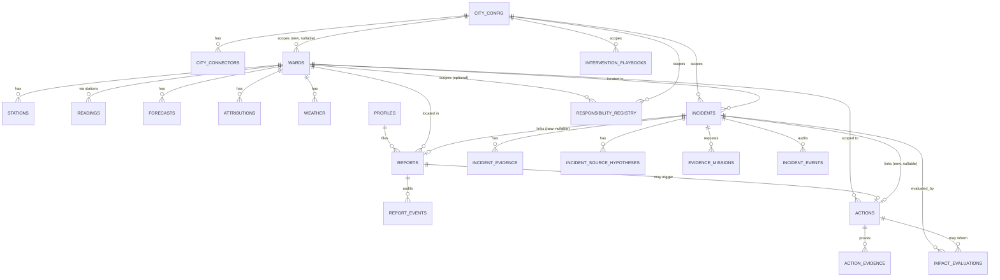

# Vayu Gati — Data Model

Companion to [ARCHITECTURE.md](ARCHITECTURE.md). Describes every table as of
this migration: the pre-existing baseline (`supabase/schema.sql` +
`supabase/migrations/20260714*.sql`), the incident-centred slice
(`supabase/migrations/20260717000000_incidents_core.sql`), the Phase 3
workflow migration (`supabase/migrations/20260717010000_incident_workflow.sql`),
the Phase 4 intervention/impact migration
(`supabase/migrations/20260718000000_intervention_and_impact.sql`), the
Phase 5 intervention-playbooks migration
(`supabase/migrations/20260719000000_intervention_playbooks.sql`), Phase 5.1's
recurrence/custom-hardening migration
(`supabase/migrations/20260720000000_recurrence_and_custom_hardening.sql`),
Phase 6's anomaly-detection migration
(`supabase/migrations/20260721000000_anomaly_detection.sql`), and Phase 7's
probable-source attribution migration
(`supabase/migrations/20260722000000_source_attribution.sql`).

Everything below is verified by `./supabase/tests/run.sh`, which rebuilds a
disposable Postgres from these files and exercises the rules and RLS as a real
`authenticated` user — see [supabase/tests/README.md](../supabase/tests/README.md).

## Entity relationship overview



## Pre-existing baseline (unchanged in this pass)

| Table | Purpose | Key columns |
|---|---|---|
| `wards` | Ward/hotspot reference (Delhi seed: 13) | `dominant_source`, `lat/lng`, `boundary` |
| `stations` | Monitoring station → ward | `external_ref` (OpenAQ id) |
| `profiles` | 1:1 with `auth.users` | `role`, `ward_id`, `lang` |
| `readings` | Ingested pollutant time series | all 6 pollutants + `aqi`, unique `(station_id, ts)` |
| `weather` | Ingested weather time series | per ward/hour |
| `forecasts` | 48h PM2.5 forecast per ward | `local_excess`, `confidence`, `model_version` |
| `attributions` | Wind-direction attribution per ward | `breakdown` jsonb, `direction`, `confidence` |
| `reports` | Citizen submission | `ai_category`, `ai_meta`, `status`, **`incident_id` (new, nullable)** |
| `actions` | Enforcement/task queue | `priority_score`, `evidence`, `status`, **`incident_id` (new, nullable)** |
| `report_events` | Append-only status audit trail | drives the "Gati" metric |

`user_role`, `report_status`, `source_category` enums are unchanged and are
deliberately **reused** by the new tables below rather than duplicated —
`source_category` in particular already models pan-India-generic categories
(construction dust, road dust, open burning, industrial, vehicular, waste,
other), so a second, incident-specific category enum would just be drift.

## New: incident-centred schema (`20260717000000_incidents_core.sql`)

All additive. No existing table, column, row, or policy was altered or
dropped. Two nullable FK columns were added (`reports.incident_id`,
`actions.incident_id`) plus one nullable FK on `wards` (`city_id`).

| Table | Purpose | Notes |
|---|---|---|
| `city_config` | One row per City Pack (plan §20) | Delhi seeded; `pollutant_priority`, `supported_languages`, `config` jsonb hold what would otherwise be hardcoded |
| `city_connectors` | Declares which provider feeds a city (plan §7) | Seeded with the *real* current state: OpenAQ + Open-Meteo enabled, mobility/satellite/GIS explicitly `not_configured` |
| `incidents` | The central object (plan §2) | `detection_method` is `NOT NULL` by design — an incident must always cite how it was detected, never implied from a bare reading insert |
| `incident_evidence` | Supporting/contradictory evidence items | `supports boolean` — explicit, not inferred |
| `incident_source_hypotheses` | Probabilistic source breakdown (plan §8) | `probability` constrained to `[0,1]`; `confidence_level` uses the required suspected/corroborated/officially_verified scale |
| `evidence_missions` | Next-best-evidence requests (plan §10) | `rationale` column exists so "why this evidence is needed" is always recorded, not just the ask |
| `responsibility_registry` | Source→authority routing (plan §12) | `is_disputed` flag for overlapping/contested jurisdiction |
| `intervention_playbooks` | Configurable playbooks (plan §13) | `approval_level` (automatic/command/authorised_legal) and `evidence_basis` (literature/expert_estimate/vayu_gati_observation) are required, not free text |
| `incident_events` | Timeline/audit trail | Same shape as the existing `report_events`, deliberately, for consistency |
| `action_evidence` | Operational proof for a task (plan §15) | `is_offline_capture` flag anticipates the field app's offline-draft requirement |
| `impact_evaluations` | Environmental verification, separate from action completion (plan §15) | `outcome` uses the required 7-state enum; defaults to `inconclusive`, never fabricated |

### New enums

- `source_confidence_level`: `suspected` / `corroborated` / `officially_verified`
- `incident_outcome`: `effective` / `partly_effective` / `ineffective` / `inconclusive` / `source_disproved` / `completed_no_change` / `recurred`
- `incident_status`: `detected` / `under_review` / `evidence_gathering` / `routed` / `action_approved` / `action_dispatched` / `in_progress` / `verifying` / `closed`
- `incident_classification`: `local` / `mixed` / `regional` / `uncertain`
- `approval_level`: `automatic` / `command` / `authorised_legal`
- `mission_status`: `proposed` / `dispatched` / `in_progress` / `completed` / `cancelled`

### Why `resolved` on `reports`/`actions` was not touched

The plan asks to "replace binary `resolved` with evidence-backed outcome
states" — but doing that on the *existing* `reports`/`actions` tables would be
a breaking, non-additive change to a column every current screen reads.
Instead, this pass adds the outcome model as a **new, parallel** concept
(`impact_evaluations.outcome`) linked optionally to an incident/action. The
next slice can start writing `impact_evaluations` rows without breaking any
current officer/citizen screen; only once that flow is proven should
`reports.status`/`actions.status` be deprecated in favour of it. This is the
"keep the app usable, no destructive change until the new flow is verified"
rule applied literally.

## RLS summary (new tables)

Same posture as the baseline: `auth_role()` / `auth_ward()` gate everything,
no new helper functions introduced.

| Table | Read | Write |
|---|---|---|
| `city_config` | any authenticated | service_role only |
| `city_connectors` | commander/admin | service_role only |
| `incidents` | commander/admin (all); field_officer (own ward); citizen (only incidents linked to their own report) | field_officer (own ward)/commander/admin |
| `incident_evidence`, `incident_events` | follows parent incident visibility (including the citizen carve-out) | any authenticated (insert only) |
| `incident_source_hypotheses` | commander/admin, field_officer (own ward) | commander/admin only |
| `evidence_missions` | assignee, or commander/admin, or field_officer (own ward) | assignee, or commander/admin |
| `responsibility_registry` | field_officer (own ward or unscoped rows)/commander/admin | commander/admin only |
| `intervention_playbooks` | field_officer/commander/admin | commander/admin only |
| `action_evidence` | follows parent action's ward visibility | field_officer (own ward)/commander/admin |
| `impact_evaluations` | follows parent incident visibility (incl. citizen carve-out) | commander/admin only |

**Validated:** this migration was applied to a disposable local Postgres
(with stub `auth`/`storage` schemas matching Supabase's shape) end-to-end,
twice in a row (idempotency check), and the resulting tables/RLS/seed rows
were inspected — see the Phase 1+2 summary in
[IMPLEMENTATION_STATUS.md](IMPLEMENTATION_STATUS.md) for exact commands. It
has **not** been applied to the real hosted Supabase project — that requires
`make db-push` with the project owner's own Supabase login, per
`README.md`.

---

## Phase 3: `20260717010000_incident_workflow.sql`

Makes the Phase 2 schema *operable*. Additive; no existing table, column or row
is altered destructively. It exists because Phase 2's schema had no way to
actually move a report into an incident.

### New columns

| Table | Columns | Why |
|---|---|---|
| `incidents` | `assigned_authority`, `local_excess`, `severity` | The queue must show who owns it and how bad it is without re-deriving from live forecasts, which move under the operator's feet. `severity` is a **snapshot at detection**, `null` when the ward has no forecast — shown "Unavailable", never defaulted to `low`. |
| `evidence_missions` | `outcome`, `checklist_response`, `proof_photo_url`, `lat`, `lng`, `notes`, `public_prompt` | The field submission. Real columns, not `result` jsonb keys, because the workflow queries and gates on them. `public_prompt` is the citizen-facing question, kept **separate from `rationale`** (see privacy, below). |
| `actions` | `approval_level`, `approved_by`, `approved_at` | Enforcement needs a named human approver (plan §14). |
| `incident_events` | `is_public` (default **false**) | Citizen timeline. Defaulting to false means an event type added later is private until someone deliberately opts in. |

### Functions

| Function | Purpose |
|---|---|
| `link_report_to_incident(report_id, recency_hours, radius_m)` | The match-or-create rule. `security definer`. |
| `list_assignable_officers(ward_id)` | Field officers a commander may dispatch to. `security definer`. |
| `list_my_citizen_missions()` | The citizen's verification requests — safe columns only. `security definer`. |
| `submit_citizen_verification(mission_id, outcome)` | Records a citizen's answer. `security definer`. Never touches `source_confidence`. |

### Why four security-definer functions instead of RLS policies

Each replaces a capability RLS cannot express safely, and each checks the
caller's role **inside** the function (security definer bypasses RLS, so those
checks are the entire guard):

- **`link_report_to_incident`** — under the Phase 2 policies a citizen cannot
  insert `incidents` (blocked) and cannot update `reports.incident_id` (the
  UPDATE silently affects **0 rows**, no error). Both verified. So the link step
  cannot run as the citizen from the browser at all. It also makes match+insert
  atomic under a ward advisory lock — which is what actually prevents duplicate
  incidents when several reports arrive at once. A read-then-write from the
  browser could not.
- **`list_assignable_officers`** — the baseline `profiles_self_read` policy lets
  a user read only their own row, so a commander querying `profiles` gets **0
  officers** (verified). Rather than widening `profiles` (which would expose
  phone numbers and every user's row), this returns only id/name/ward for field
  officers.
- **`list_my_citizen_missions` / `submit_citizen_verification`** — see privacy.

### Evidence-level task rules (trigger)

`enforce_incident_action_rules` on `actions`, firing only when `incident_id` is
set (so the pre-existing report-scoped action flow is untouched):

| Incident evidence level | Permitted |
|---|---|
| `suspected` | evidence missions only — an action task is **rejected** |
| `corroborated` | inspection / preventive action |
| `officially_verified` | enforcement — **and only** with `approved_by` set |

Enforced in the database, not just the UI, so the rule holds regardless of which
client writes. `web/src/lib/incidentRules.ts` mirrors it so the UI can *explain*
the rule rather than surfacing a raw Postgres error.

### Citizen privacy: three narrowed policies

All three are **narrower** than Phase 2. Nothing was widened.

1. `incident_events_read` — the citizen carve-out now requires `is_public`.
2. `evidence_missions_write` (`for all`) → split into `_insert` (commander/admin)
   and `_update` (commander/admin or assignee). Phase 2's `for all` let an
   assignee **insert** arbitrary self-assigned missions, because INSERT ignores
   `using`.
3. `evidence_missions_read` — citizens lose direct read entirely. Phase 2 let any
   assignee select the whole row, so a citizen could fetch `rationale` — the
   internal note that may name the responsible authority or enforcement intent —
   straight from the API, even though no screen displayed it. Filtering in the
   client would not have been a control; the row still crossed the wire. Field
   officers keep full access: they need the rationale to do the job.

### The matching rule

A report joins an open incident when **all** hold:

1. incident is open (`status <> 'closed'`);
2. same ward;
3. detected within `recency_hours` (default 12);
4. compatible category — the incident's leading hypothesis equals the report's
   `ai_category`, **or** either side has no category yet. An unclassified report
   must not fabricate a match against a *different* known category;
5. within `radius_m` (default 750) when **both** have coordinates; when either
   lacks them, ward + recency + category is the fallback.

Best candidate = closest when distances are known, else most recently detected.
Otherwise a new incident opens. Every outcome writes an `incident_events` row.
Re-linking an already-linked report is a no-op.

`suspected → corroborated` requires **≥2 distinct reporters** agreeing on the
category — one person reporting twice is not independent corroboration
(plan §9's "multiple independent signals").

Source hypotheses are rebuilt from linked reports by a stated counting rule
(`model_version = 'report_vote_v1'`): probability = share of linked classified
reports naming that category. It is a counting rule, not a model, and says so.

### Rollback

Both incident migrations are additive and independently revertible: dropping the
new functions, trigger and columns restores the previous behaviour, since no
existing column was altered or dropped and the report/action flow never depends
on any of them. The three replaced policies would need restoring from
`20260717000000_incidents_core.sql` — each is a `drop policy if exists` +
`create policy` pair, so re-running that file's policy section is the revert.

---

## Phase 4: `20260718000000_intervention_and_impact.sql`

Closes the loop from a verified source to a **measured** outcome. Additive; no
existing table, column, row or RLS policy is altered destructively — see below
for the one thing that *is* replaced (the trigger function) and why that is
still additive in effect.

### New enum: `action_workflow_status`

`actions.status` (the pre-existing `report_status` enum) is **left completely
untouched** — it is what the legacy, non-incident report queue in `FieldView`
still reads, and repurposing it to carry eleven new states would be exactly the
breaking change the migration rules forbid. The Phase 4 lifecycle lives in a
**new** column, `actions.workflow_status`, typed to a new enum:

```
drafted → awaiting_approval → assigned → accepted → in_progress → completed
  → verification_pending → { effective | partly_effective | ineffective | inconclusive }
                                                              ↳ reopened (on recurrence)
```

The first seven are **operational** states (what the team did); the last four
are **outcome** states (whether pollution changed). These are deliberately
different tokens with a deliberate boundary between them — the entire point of
plan §15 ("a photo proves activity occurred; it does not prove pollution
reduction") is that a client can walk an action through `completed` all day and
never touch an outcome state without a real measurement backing it.

### New columns

| Table | Columns | Why |
|---|---|---|
| `actions` | `workflow_status`, `recommended_action`, `responsible_agency`, `deadline`, `expected_verification_hours`, `accepted_at`, `started_at`, `completed_at`, `source_confirmed`, `not_completed_reason` | Everything the brief's "store recommended action, responsible agency, assignee, deadline, approval, expected verification window and status" asks for. `assignee` and `approval` reuse the existing `assigned_to`/`approved_by`/`approval_level`/`approved_at` columns from Phase 3 rather than duplicating them. |
| `impact_evaluations` | `observation_window_hours`, `station_label`, `data_completeness`, `pct_change`, `method_limitation` | The before/after method's actual inputs/outputs — `before_value`/`after_value`/`outcome`/`confidence` already existed from Phase 2. |

### Two triggers (one replaced, one new)

**`enforce_incident_action_rules`** (replaces the Phase 3 function of the same
name — `create or replace`, not a new trigger) now does two things:

1. The Phase 3 creation gate (suspected → refused; enforcement → verified
   source + named approver) applies only at **creation** (INSERT, or the row's
   `incident_id` changing) — a later evidence-level *downgrade* on the incident
   must not retroactively block a routine workflow-status update on an action
   that was legitimately created earlier.
2. **New**: an action cannot be written to an **outcome** state
   (`effective`/`partly_effective`/`ineffective`/`inconclusive`) unless a row
   already exists in `impact_evaluations` for it. This is the literal database
   enforcement of "action completed is not pollution reduced" — verified by
   test 13c (blocked with no evaluation) and 14b2 (allowed once one exists).

**`enforce_incident_closure_rules`** (new, on `incidents`): refuses to set
`status = 'closed'` while the incident has any action in `completed` or
`verification_pending` with **no** `impact_evaluations` row. This is the literal
database enforcement of "an incident must not close merely because an action
photo was uploaded" — verified by test 15a (blocked) / 15b (allowed once
evaluated, even if the evaluation itself is inconclusive — an *attempted*
measurement is what's required, not a *successful* one).

### `record_impact_evaluation()` — the transparent before/after method

The stated rule (plan §16: "never present a model probability as proven"):

```
before/after null, before <= 0, or completeness < 0.5   → inconclusive
reduction >= 40%                                         → effective
reduction >= 15%                                         → partly_effective
otherwise (including an increase)                        → ineffective
```

**The outcome is computed server-side, not accepted from the caller.** A client
cannot pass `outcome: 'effective'` — there is no such parameter. This is what
makes "do not claim pollution reduction when data is missing or inconclusive" a
property of the system rather than a UI convention: even a compromised or
careless client cannot fabricate a result the numbers don't support. Every row
also carries a fixed `method_limitation` string stating plainly that this is
before/after only — **not weather-adjusted and not causal proof**. `confidence`
is set to the completeness value (a proxy for how much of the observation
window actually had data), and is explicitly `null`, not a number, when the
result is inconclusive — there is nothing to be confident about.

On success the function also: reflects the outcome onto the triggering action's
`workflow_status` (so the closure trigger's check passes), moves the incident to
`verifying` (**never** to `closed` — closing stays a distinct, separately
guarded human decision), and writes a public `incident_events` row explaining
the result in plain language.

RLS on `impact_evaluations` is **unchanged from Phase 2**
(`impact_evaluations_write` = commander/admin only) — verified by test 14a: a
field officer's own call to this function is rejected. Impact evaluation is a
command decision, not an operational one.

### `submit_citizen_action_verification()`

The citizen half of §15/§11. Checks the caller has a report linked to the
incident (security definer; verified: an unlinked citizen is refused, test
17a), then inserts one `incident_evidence` row with `supports = null` (a
citizen's answer is neither a clean confirmation nor a clean denial — it is
supporting context) and a public `incident_events` row. It **never** writes to
`impact_evaluations.outcome` or `incidents.source_confidence` — verified by test
17c, which records an evaluation, then submits a citizen answer, then re-reads
the evaluation and asserts it is byte-identical.

### What a citizen can and cannot see, verified

| Table | Citizen read | Why |
|---|---|---|
| `actions` | **None** (RLS returns 0 rows) | No enforcement type, responsible agency, approver or deadline is ever exposed — test 18a. |
| `action_evidence` | **None** | Operational proof (GPS, checklists, photos) stays internal — test 18b. |
| `impact_evaluations` | **Full** (Phase 2 policy, unchanged) | Intentional, not a gap: an environmental outcome is exactly what plan §11/§15 wants a citizen able to track ("verify whether the intervention worked"). It carries no agency/approver detail — that lives on `actions`, which citizens cannot read at all. Verified as a deliberate pass, not a surprise, in test 18c. |

### Auditability

Every state-changing function in this migration (`record_impact_evaluation`,
`submit_citizen_action_verification`, plus the intervention-lifecycle writes
made from `web/src/lib/incidents.ts`) writes a corresponding `incident_events`
row — approval, assignment, each workflow step, the impact result, and reopen
are all in the same append-only timeline Phase 3 established, with the same
`is_public` default-false rule. Nothing in this phase writes state without also
writing why.

### Rollback

Additive and independently revertible: dropping `workflow_status` and the other
new columns, the two triggers, and the three new functions restores Phase 3
behaviour exactly, since the legacy `actions.status`/non-incident action flow
was never touched and nothing outside this file depends on the new objects.

---

## Phase 5: `20260719000000_intervention_playbooks.sql`

Replaces free-text intervention creation with structured, source-specific
templates, reusing the **existing** `intervention_playbooks` table (schema
since Phase 2, populated and read for the first time in this pass) rather than
a parallel table. Additive; the one thing that is replaced is, again, the
trigger function — same reasoning as Phase 4, still additive in effect.

### New columns on `intervention_playbooks`

| Column | Why |
|---|---|
| `action_type` (NOT NULL, CHECK-constrained) | Controlled vocabulary matching the DB trigger's enforcement-type list plus the operational types the UI already offered, plus the new source-specific types this pass's seed set needs. |
| `responsible_agency_type` | A default authority *label* (e.g. "Traffic police"), prefilled onto `actions.responsible_agency` and still editable per incident — a real name→authority mapping is still `responsibility_registry`'s job, not wired up. |
| `instructions` | Operational narrative, distinct from the itemised `checklist` jsonb. |
| `estimated_cost_min` / `estimated_cost_max` | A cost **range**, not the single `estimated_cost` value Phase 2 added. `estimated_cost` is left in place, untouched and unpopulated — dropping/renaming even an unused column is not how this repo does additive migrations (same pattern as `actions.status` vs `actions.workflow_status` in Phase 4). |
| `expected_time_to_effect_hours` | How long after deployment pollution is expected to start responding — distinct from the pre-existing `expected_duration_hours` (how long the effect persists once achieved) and from `estimated_minutes` (time to deploy). Three separate time concepts, deliberately not conflated. |
| `verification_window_hours` | Prefills `actions.expected_verification_hours` at selection time. |
| `recommended_pollutants` (text[]) | Which pollutants the before/after check should focus on — advisory only. |
| `for_regional` (NOT NULL, default false) | The *only* playbooks ever shown for an incident classified `regional`; every other playbook is hidden for one. Paired with a CHECK that a regional playbook cannot also claim a specific `source_category`. |
| `version` (NOT NULL, default 1) | Bumped by a human editing the master template — never by this migration or by any code that reads impact outcomes (see "learning loop" below). Snapshotted onto `actions.playbook_version` at selection time. |
| `slug` (nullable, UNIQUE) | The natural key that makes the seed inserts idempotent — `bigserial id` alone cannot be (every re-run would insert a fresh id and duplicate every row). Nullable so a future non-seeded playbook needs no slug. |

### New columns on `actions`

| Column | Why |
|---|---|
| `playbook_id` | Which playbook (if any) produced this intervention. Null for a free-text/custom intervention. |
| `playbook_version` | Snapshot of the playbook's `version` at selection time, so a historical action stays interpretable even after the live template changes. |
| `playbook_notes_override` | The commander's **only** editable field when creating from a playbook — a per-incident addendum, never a mutation of the playbook's own `instructions`/`checklist`. This is what keeps an "edit" structurally incapable of touching `min_evidence_level` or any other gate. |
| `checklist_snapshot` | A snapshot of `intervention_playbooks.checklist` at selection time — verified stable under a live playbook edit (test 22d: editing the playbook's checklist after an action references it does not change that action's snapshot). |

### The playbook-tier evidence-level check (trigger, extended again)

`enforce_incident_action_rules` (same function, `create or replace`d a third
time) gains one more check, only at creation: when `actions.playbook_id` is
set, `incidents.source_confidence` must meet or exceed that playbook's
`min_evidence_level`. `source_confidence_level` is declared
`('suspected', 'corroborated', 'officially_verified')`, and Postgres orders
enum values by declaration order and supports direct `<`/`<=`/`>`/`>=`
comparison — so "meets or exceeds" is a plain comparison, no ordinal-mapping
table needed in SQL (`web/src/lib/incidentRules.ts`'s `CONFIDENCE_RANK` mirrors
this for the UI side).

**Why this is additive defence-in-depth, not the core safety gate**: the
pre-existing enforcement-type gate (penalty/stop_work/closure/restriction/
prosecution require `officially_verified` + a named `approved_by`) keys off
`actions.type` directly and has never consulted `intervention_playbooks` at
all — verified by test 21e/21f, which shows the enforcement-tier seeded
playbook still refuses with no approver even though it is correctly tiered.
So a commander editing a playbook's `min_evidence_level` (they already have
Phase 2 write access to this table) can never lower the bar for real
enforcement — that gate doesn't read the playbook. What this new check
*does* close: test 21d isolates it directly, showing a *non*-enforcement
`action_type` from a playbook mis-tiered to `officially_verified` is still
refused below that tier — without this check, a playbook merely *labelled*
as needing more evidence could be used below that label.

### Why no new SQL function was needed

Unlike Phase 3/4, this migration adds no security-definer function.
Listing/ranking/eligibility is read-only and pure — it lives entirely in
`web/src/lib/incidentRules.ts` (`isPlaybookEligible`, `scorePlaybook`,
`rankPlaybooks`), transparent and rule-based (no ML, per the brief), and is
unit-tested directly rather than through SQL. Creating an action from a
playbook is a plain insert through the same trigger every other action already
goes through — `createInterventionFromPlaybook` in `incidents.ts` fetches the
live playbook row client-side (RLS already allows field_officer/commander/
admin read) and inserts, exactly like Phase 4's free-text `createIntervention`.

### Eligibility and ranking (client-side, transparent, no ML)

`isPlaybookEligible(playbook, ctx)` — every condition is a hard filter, not a
scoring input:

- `is_active` must be true;
- `city_id` must equal the incident's city, or be `null` (a national default —
  "allow future ... national default playbooks", satisfied by a nullable
  column read generically, not a Delhi-specific code branch);
- `for_regional` must exactly match `classification === 'regional'` — the
  literal encoding of "regional/non-local → do not recommend ineffective
  local action" (and its converse: never recommend the regional advisory for
  a genuinely local problem);
- the incident's `source_confidence` must meet-or-exceed the playbook's
  `min_evidence_level` (mirrors the DB trigger exactly);
- for a non-regional playbook, `source_category` must match the leading
  hypothesis (or be `null` — a source-agnostic local playbook, none seeded
  yet but supported).

A `suspected` incident sees **zero** eligible local playbooks by construction
— every seeded local playbook requires at least `corroborated` — so "suspected
→ evidence-gathering only" falls out of the eligibility rule with no separate,
redundant "evidence-gathering playbook" concept needed (evidence_missions
already owns that job).

`rankPlaybooks` scores every eligible playbook on five stated, weighted
factors (source match 40, evidence-level fit 20, urgency-vs-timing 15, cost
15, resource availability 10 — every weight a documented constant) and returns
plain-language reasons generated from the same signals ("show why each
playbook is recommended"). **Affected population is deliberately never
scored** — no population/exposure layer exists in this codebase (plan §7 lists
it as a required input, not yet built); the parameter exists so the function
has somewhere correct to read from once that data exists, and inventing a
number would violate the "do not fake integrations" rule. Resource
availability is scored only "when known" — unknown is neutral, never
penalised as if a ward had zero officers.

### Learning loop (read-only, never rewrites the playbook)

`tallyPlaybookUsage` (pure) and `fetchPlaybookUsageBatch`/
`fetchPlaybookUsageWorkflowStatuses` (I/O) tally a playbook's historical
`actions.workflow_status` values into times-used / effective / partly
effective / ineffective / inconclusive / pending. This is read-only
aggregation with **no write path back to `intervention_playbooks` anywhere in
this codebase** — "do not automatically rewrite playbook estimates" is
satisfied by the absence of such code, not by a flag that could be flipped.

### Seeded: six Delhi playbooks

City-scoped (`city_id` = Delhi's row from `city_config`) — the eligibility/
ranking code filters by whatever `incident.city_id` resolves to; Delhi is
**data** here, never a code branch. Each is idempotent via its `slug`:

| Slug | Source | Tier | Type |
|---|---|---|---|
| `delhi-road-dust-sweeping` | road dust | corroborated | vacuum sweeping + debris removal |
| `delhi-construction-dust-inspection` | construction dust | corroborated | inspect covering/wheel-wash/track-out |
| `delhi-open-burning-extinguish` | open burning | corroborated | verify, extinguish, remove waste |
| `delhi-vehicular-traffic-management` | vehicular | corroborated | traffic-point management |
| `delhi-industrial-stop-work` | industrial | **officially_verified** | stop-work order (the one enforcement-tier example) |
| `delhi-regional-advisory` | *(none — regional)* | suspected | monitoring + public advisory, no local enforcement |

Every row's `evidence_basis` (`literature` / `expert_estimate` /
`vayu_gati_observation`) and `known_limitations` are populated — "distinguish
literature-based estimates from locally observed results" and "never present
expected impact as guaranteed" are both satisfied on the data, not left to UI
discipline: the command workspace renders both fields on every playbook shown.

### Auditability

Playbook selection is logged to `incident_events` (`task_created`, public,
payload includes `playbook_id`/`playbook_slug`/`playbook_version`) by
`createInterventionFromPlaybook` — the same append-only timeline every other
phase's state changes go through.

### RLS

Unchanged from Phase 2 (`intervention_playbooks_read`:
field_officer/commander/admin; `_write`: commander/admin) — exercised by a
dedicated test for the first time in this pass (tests 24–25): a citizen has
**zero** read and **zero** write on this table.

### Rollback

Additive and independently revertible: dropping the new `intervention_playbooks`
and `actions` columns and reverting the trigger function to its Phase 4 body
restores Phase 4 behaviour exactly. No existing column, row, or policy was
altered.

## Phase 5.1: `20260720000000_recurrence_and_custom_hardening.sql`

Two things, both additive: citizen recurrence reporting (a new table + two
security-definer functions) and custom-intervention hardening (the trigger
function, `create or replace`d a fourth time, plus one new `actions` column).

### New table: `incident_recurrence_reports`

| Column | Why |
|---|---|
| `incident_id` | The **original** (necessarily closed) incident the citizen is reporting against — never changed by any review decision. |
| `reporter_id` | The citizen. Nullable (matches `reports.reporter_id`'s own nullability convention) though the submit function always sets it from `auth.uid()`. |
| `recurrence_type` (CHECK) | `returned` / `partially_returned` / `action_temporary` / `unable_to_confirm` — the plan's own four options, no free-text category. |
| `note`, `lat`, `lng`, `photo_url` | Optional citizen evidence, same shape as a `reports` row. |
| `review_status` (CHECK, default `pending`) | `pending` / `more_evidence_requested` / `confirmed` / `dismissed`. |
| `public_response` | The **only** text a citizen is ever shown about the review outcome — internal reasoning goes to `incident_events` with `is_public = false`, the same public/internal split as every other citizen-facing surface in this codebase. |
| `reviewed_by`, `reviewed_at` | Set by command on any review decision. |
| `resulting_incident_id` | Set only when command chooses "create a new linked incident" or "merge into an already-open nearby incident". Null for a reopen decision (the incident's own status moving off `closed` already represents that) and null while pending. |

Indexed on `(incident_id, review_status)` (the command review queue's own
access pattern) and `(reporter_id, incident_id, review_status)` (duplicate
detection).

### New column: `incidents.recurrence_of_incident_id`

Nullable, self-referencing. Paired with the report's own
`resulting_incident_id`: that column points report → new incident; this one
points new incident → the incident it recurred from. Together they make
"linked incidents preserve traceability" checkable in both directions
(verified by tests 31a/31b).

### Widened: `incident_evidence.evidence_type`

Gains one more allowed CHECK value, `recurrence_report`, so a "merge with an
already-open nearby incident" command decision can attach the recurrence
report's own evidence (note/photo/location) onto the **target** incident,
alongside the existing evidence types. Additive in effect — widens the
allowed set; no existing row's `evidence_type` is touched (test 32a).

### `submit_incident_recurrence_report()` — the citizen's entire write path

Security definer, same reasoning as `submit_citizen_action_verification`: the
ownership check ("does this citizen have a report linked to this incident")
mixes two tables in a way a standard RLS policy shape cannot express for an
INSERT before the row exists to check against. Refuses unless the incident is
`closed` and the caller has a `reports` row linked to it (test 26a/26d).

**Deliberately does not touch `incidents` or `actions` anywhere in its body** —
that absence is the guarantee that a citizen's recurrence report can never
automatically reopen the incident or create an enforcement task (tests
26e/26f). It only ever writes the report row itself plus one public
`incident_events` row (`recurrence_submitted`, test 26g).

**Duplicate detection**: if the same reporter already has a `pending` report on
this incident, the call is idempotent — it returns that report's id rather
than inserting a second one (tests 28a/28b). Once command reviews it (status
moves off `pending`), a further recurrence is treated as a new, independent
signal.

### `list_my_recurrence_reports()` — the citizen's entire read path

Returns only citizen-safe columns for the caller's own reports on one
incident — never `reviewed_by`, never another citizen's rows (test 27b/27c).
`outcome_kind` (`'reopened'` / `'new_incident'` / `null`) is **computed
server-side** rather than exposing the raw `resulting_incident_id` FK: a
citizen is told *whether* their report led to a reopen or a new linked
incident in words, without being handed an id they usually cannot open anyway
under `incidents_read` (their own report stays linked to the *original*
incident, not the new one).

### RLS on `incident_recurrence_reports`

Read: commander/admin (all), field_officer (ward-scoped via the parent
incident, test 33a/33b). Citizens have **no direct read at all** (test 27a) —
structural, matching `evidence_missions`: they go through
`list_my_recurrence_reports()` instead. Write: commander/admin only, for the
plain RLS-gated review-decision updates (dismiss/request-evidence/confirm/set
`resulting_incident_id`); the only INSERT path is the security-definer submit
function above. A citizen's own attempted UPDATE affects **0 rows**, silently
— the same RLS-no-op pattern as a citizen's own `reports.incident_id` update
(test 29a).

### Custom-intervention hardening (trigger, extended a fourth time)

`enforce_incident_action_rules` gains real **database-enforced** guarantees
that were previously only true because the only UI that called
`createIntervention`/`createInterventionFromPlaybook` happened to live behind
a commander-only route. **Verified gap, not assumed**: the baseline
`actions_write` policy in `schema.sql` grants a field_officer `for all` on any
action in their own ward, with no distinction for incident-linked vs legacy
or custom vs playbook rows — so a field-officer client could previously
INSERT an incident-linked action directly, bypassing the command-only UI
entirely (confirmed by reading `schema.sql`, then closed and verified by test
34a). New checks, all firing only when an incident-linked action is being
created (`INSERT`, or `UPDATE` that changes `incident_id`):

- **Commander-only creation** — creating any incident-linked action, playbook-based
  or custom, now requires `commander`/`admin` (test 34a/34b).
- **Mandatory `custom_reason`** — a custom (no `playbook_id`) incident-linked
  action must carry a non-empty (whitespace-trimmed) `custom_reason` (tests
  35a/35b). New nullable column `actions.custom_reason`; nullable at the
  column level (legacy/report-scoped and playbook-based rows never set it) —
  the trigger is what makes it mandatory exactly where it needs to be.
- **Regional-classification compatibility for the custom path too** — the
  same "do not allow ineffective local action against a regional source" rule
  Phase 5's playbook eligibility already applied client-side, now enforced
  here so it cannot be sidestepped by typing free text instead of picking the
  regional playbook (tests 38a/38b).
- **Post-approval immutability** — once `approved_by` is set, `type` /
  `recommended_action` / `responsible_agency` / `custom_reason` become
  immutable (tests 39a/39b); non-descriptive operational fields (e.g.
  `deadline`) remain editable (test 39c). A genuine change means creating a
  new intervention, which is the auditable path.

The pre-existing evidence-level gates (suspected → refused; enforcement →
`officially_verified` + named approver; playbook-tier ordinal check) are
**untouched and still apply to the custom path** — typing free text instead
of selecting a playbook never lowers the bar (tests 36a/36b/37a/37b).

### Guaranteed audit trigger: `log_action_creation_event()`

A **new**, separate `AFTER INSERT` trigger (not the same trigger as the
validation above, and not `BEFORE`) writes the creation event directly from
SQL — `task_created` for a playbook-based action, `custom_intervention_created`
(naming the `custom_reason`) for a custom one (tests 40a/40b). `AFTER INSERT`
so it only ever fires once the row genuinely exists, and so the event write
can never be the reason a legitimate creation fails. This **replaces** the
client-side `addIncidentEvent` call `createIntervention`/
`createInterventionFromPlaybook` previously made best-effort after the
insert — those client-side calls were removed from `incidents.ts` in this
pass to avoid a duplicate event per creation. "Immutable audit event,
guaranteed" (plan §9) is now a database guarantee, not a client convention.

### Reopen vs. new-linked-incident: a recommendation only, never automated

`recommendRecurrenceDecision` (pure, `web/src/lib/incidentRules.ts`) scores
three stated, documented signals — reported within `168h` of closure ("soon
after"), reported after a `720h` gap ("substantial"), and reported within
`300m` of the original incident ("materially the same location") — plus the
citizen's own `action_temporary` answer or a `partly_effective` prior impact
outcome as a corroborating "temporary effect" signal. It returns a
recommendation (`reopen` / `new_incident` / `uncertain`) and plain-language
reasons, shown in the command review queue alongside six manual decision
buttons (dismiss / request more evidence / confirm / reopen / create new
linked incident / merge with nearby open incident). **Nothing in this
codebase acts on the recommendation automatically** — every actual
disposition in `incidents.ts` (`reopenIncidentFromRecurrence`,
`createLinkedIncidentFromRecurrence`, `mergeRecurrenceIntoIncident`, etc.) is
a separate, explicit, command-only call.

### Auditability

New event types on `incident_events`: `recurrence_submitted`,
`recurrence_dismissed`, `recurrence_more_evidence_requested`,
`recurrence_confirmed`, `recurrence_reopened_incident`,
`recurrence_new_incident_created`, `recurrence_merged` (recurrence side);
`custom_intervention_created` (custom-hardening side, from the new guaranteed
trigger). All written to the **original** incident's timeline, per plan §4
("appear in the original incident timeline").

### Rollback

Additive and independently revertible: dropping the new
`incident_recurrence_reports` table, the `incidents.recurrence_of_incident_id`
and `actions.custom_reason` columns, narrowing `incident_evidence`'s
`evidence_type` CHECK back to its Phase 4 set, dropping the
`log_action_creation_event` trigger, and reverting
`enforce_incident_action_rules` to its Phase 5 body restores Phase 5 behaviour
exactly. No existing column, row, or policy was altered.

## Phase 6: `20260721000000_anomaly_detection.sql`

Automated, rule-based (no ML) pollution anomaly detection from monitoring
data, and predicted/detected incident creation from it — the first code in
this repo that ever creates an `incidents` row from `readings` alone.

### New enum + columns

| Object | Why |
|---|---|
| `incident_detection_stage` enum (`predicted`/`detected`/`confirmed`) | A third dimension, orthogonal to `status` (workflow position) and `source_confidence` (evidence about the SOURCE): "how mature is the detection itself?" Null for every incident that did NOT originate from automated detection — exactly like `classification` is null until evidence allows it. |
| `incidents.detection_stage` | Set only by `evaluate_station_pollutant_anomaly`. Drives the existing `Predicted` queue tab (`isPredicted()` now checks this first, falling back to the old `detection_method` string-prefix heuristic for any row that predates the column — none exist in practice). |
| `incidents.merged_into_incident_id` | Command's "merge with an existing incident" action — mirrors Phase 5.1's `recurrence_of_incident_id`/`resulting_incident_id` pairing. |
| `stations.sensor_type` (NOT NULL, default `'regulatory'`) | Plan's data-quality requirement to distinguish regulatory from indicative/low-cost sensors. Defaults to `'regulatory'` because every currently-seeded Delhi station genuinely IS a DPCC/CPCB government monitor (`ingest/stations.yaml`) — not a guessed value. |

### New table: `anomaly_candidates`

The rule engine's structured output — one row per station×pollutant
evaluation that fired its LEADING signal (already over threshold, or
trending toward it), whether or not it went on to create an incident. Stores
exactly what plan §4 asks for: `triggered_rules` (jsonb array —
`concentration_threshold`/`persistence`/`local_excess`/`trend_projection`),
every input/baseline value (`current_concentration`, `baseline_value`,
`local_excess`, `rate_of_increase`, `persistence_count`,
`nearby_station_diff`, `threshold_crossing_probability`,
`projected_crossing_at`), `confidence`, `detected_at`, and a data-quality
summary (`data_freshness_minutes`, `data_completeness`, `sensor_quality`,
`suppressed`, `suppression_reason`). **This row IS the "anomaly candidate
created" / "anomaly suppressed by data-quality rule" audit event** (plan
§10) — `incident_events.incident_id` is `NOT NULL` and no incident
necessarily exists yet at candidate-creation time, so the insert-only
candidate row itself is the immutable record; the only field ever touched
after insert is the `incident_id` backlink, set once/if an incident results.

RLS: commander/admin (all), field_officer (own ward) — citizens have **zero**
read at all (verified: internal detection detail, tests 51a/51b/51d). Write
is commander/admin via policy (manual correction), but the real write path
is the security-definer function below, unaffected by RLS either way.

### `evaluate_station_pollutant_anomaly(station_id, pollutant)` — the rule engine

Security definer, one station + one pollutant per call. Everything is
computed fresh from `readings` — no state carried between calls except what
lands in `anomaly_candidates`/`incidents` themselves:

1. **Signals** (plan §2): pulls the most recent `persistence_window_readings`
   *valid* readings (negative or implausible values excluded — a documented,
   generous per-pollutant sanity ceiling, not a health threshold).
   `current_concentration` = latest valid reading. `rate_of_increase` =
   linear rate across the window. `persistence_count` = how many of those
   readings already meet the threshold. `local_excess` = current minus the
   **city-wide average of every OTHER currently-reporting station** for the
   same pollutant (test 50 verifies the arithmetic directly).
   `nearby_station_diff` = the same idea, radius-limited (haversine — the
   same equirectangular approximation `link_report_to_incident` already
   uses) — null when no other station is within radius, never fabricated.
   `threshold_crossing_probability` = 1.0 once persisted; otherwise a stated
   linear projection (`(threshold - current) / rate_of_increase` hours away)
   when trending upward within the horizon.
2. **Data-quality gate** (plan §3): stale (latest reading older than the
   configured max) or incomplete (fewer valid readings than the configured
   minimum fraction of the window) data **suppresses** the candidate —
   stored, `suppressed = true`, `suppression_reason` set, `incident_id`
   stays null no matter how extreme the raw value looked (tests 44/45).
3. **Rule** (plan §4, its own literal example): `detection_stage =
   'detected'` requires concentration ≥ threshold AND persistence ≥ the
   configured minimum count AND a meaningful local excess — never one
   reading alone (test 41: a single high reading with no persistence
   produces a stored, non-incident-linked candidate, nothing more).
   `detection_stage = 'predicted'` requires NOT yet crossing, but a positive
   trend projected to cross within the configured horizon, plus a
   meaningful local excess (test 47).
4. **Confidence**: a stated, documented weighted score (0.3× threshold +
   0.3× persistence-ratio + 0.2× local-excess + 0.2× crossing-probability,
   all clamped [0,1]) multiplied by a sensor-quality factor (1.0 regulatory,
   0.7 indicative, 0.6 low-cost, 0.5 unknown) — never an ML output (test 46:
   an indicative sensor produces strictly lower confidence than a
   regulatory one on identical readings).
5. **Deduplication + create-or-update** (plan §6, done inside the SAME
   function/transaction — "server-side atomic function... not browser
   read-then-write"): a ward-scoped advisory lock using the **exact same
   lock-key namespace** `link_report_to_incident` already uses
   (`'incident_ward_' || ward_id`), so a citizen report and an anomaly firing
   for the same ward cannot race each other into two separate incidents for
   the same real event. Searches for an open incident in the same ward with
   a compatible (or unset) `primary_pollutant`, updated within the
   configured dedup window. If found and it ALSO originated from automated
   detection, its `detection_stage` may upgrade (predicted → detected;
   never downgraded once `confirmed`) and it is updated, not duplicated
   (test 43). If found but it originated from a citizen report or manual
   entry, its `detection_stage` is left untouched — the new signal is added
   as *corroborating* `incident_evidence` instead, never silently
   relabelling a human-originated incident's origin. If nothing matches, a
   new incident is created with `source_confidence = 'suspected'` (same as
   every other auto-created incident) and `detection_method` naming the
   rule that fired (`anomaly_persistence_threshold` / `anomaly_trend_projection`).

**Authorization**: an authenticated caller must be commander/admin
(`insufficient_privilege` otherwise, tests 52a/52b); an unauthenticated
caller (`auth.uid()` null) is allowed through — that is deliberately the
ingest service's service_role connection, which already bypasses RLS
entirely regardless of this function's own guard.

**Never creates an enforcement task**: the function does not touch `actions`
anywhere in its body (test 49a), and the freshly-created incident's
`source_confidence = 'suspected'` means the pre-existing Phase 3 evidence-
level gate refuses any action on it anyway, auto-detected or not (test 49b)
— the same gate every other incident in this system is already subject to,
not a new rule invented for this phase.

### `run_anomaly_detection(city_code)` — the bulk driver

Every active station in a city (or every city), for every pollutant in that
city's OWN `city_config.pollutant_priority` list (plan §1's own priority
order — defaults to pm25/pm10/no2; a city may add so2/co/o3 with zero code
change, test 55 verifies the iteration count matches stations × that city's
configured list exactly). What `ingest/app/anomaly_detection.py` calls on
the existing APScheduler cron, after ingest+forecast+attribution; also
callable directly by a commander session for on-demand verification.

### City-configurable (plan §9), seeded for Delhi

Every threshold, window, radius and horizon reads from `city_config.config
-> 'anomaly_detection'`, with documented SQL-level fallbacks used only when
a city has not configured a value (test 48 verifies a city's own configured
threshold is what actually gets used, not a hardcoded one). Delhi's seeded
values — merged into the existing `config` jsonb, safe to re-run — are
listed in [DATA_QUALITY_AND_SCIENCE.md](DATA_QUALITY_AND_SCIENCE.md) along
with their scientific basis and honest limitations.

### Auditability

`anomaly_candidates` rows are the audit trail for candidate creation and
suppression (see above). Once an incident exists, `incident_events` gains:
`predicted_incident_created`, `predicted_incident_updated`,
`promoted_to_active`, `predicted_incident_reviewed` (the "continue
monitoring" decision), `predicted_incident_dismissed`,
`predicted_incident_merged`, plus the ordinary `evidence_added` event when a
sensor signal corroborates a citizen-originated incident instead of creating
a new one. "Citizen verification requested" reuses the **existing** Phase 3
`mission_dispatched` event unchanged — see "Citizen surface" below.

### Citizen surface: reused, not rebuilt

Plan §8 ("Vayu Gati may generate a safe citizen verification request...
never expose internal source allegations, enforcement details, named
suspected facilities") is satisfied entirely by the **existing** Phase 3
`evidence_missions` / `citizen_verification` mechanism — a predicted
incident is still just an incident, and `createEvidenceMission` already
works on it with zero special-casing. No new table, function, or RLS policy
was needed for this requirement. `CitizenIncidentView` (Phase 3/5.1) was not
extended with `detection_stage`, `primary_pollutant`, or any
`anomaly_candidates` field — citizens have no reason to see any of it, and
the public `predicted_incident_created`/`_updated` events deliberately omit
`station_id`/`anomaly_candidate_id` from their payload (internal database
references with no citizen-facing meaning) even though they are marked
public, in case a citizen's own later report links to the same incident.

### Rollback

Additive and independently revertible: dropping the new `anomaly_candidates`
table, the `incidents.detection_stage`/`merged_into_incident_id` and
`stations.sensor_type` columns, and the two new functions restores Phase 5.1
behaviour exactly. No existing column, row, or policy was altered.

## Phase 7: `20260722000000_source_attribution.sql`

Transparent, rule-based (no ML) probable-source attribution for every open
incident — the first code in this repo that ever fills
`incident_source_hypotheses` from real environmental/spatial/citizen/field
evidence (Phase 3's own report-vote rule aside, which only ever counted
linked citizen reports).

### New enum labels, not a new enum

Three labels appended to the **existing** `source_category` enum
(`regional_transport`, `mixed`, `unresolved`) via `ALTER TYPE ... ADD VALUE
IF NOT EXISTS` — each a standalone top-level statement (required for this
form of `ALTER TYPE`), safe because this repo's migration runners apply each
statement in its own auto-committed transaction, so a later statement in the
same file can already use the new label. The pre-existing 7 labels
(`vehicular`, `industrial` included) are byte-for-byte unchanged, so
`classify.py`, `wards.dominant_source`, `reports.ai_category` and the Phase 5
playbook seed all keep working exactly as before — deliberately NOT a
second, parallel category enum (this file's own earlier note: "a second,
incident-specific category enum would just be drift").

A `city_config.config -> 'attribution' -> 'category_labels'` jsonb map lets
the UI display the plan's own literal wording (`traffic_emissions` for
`vehicular`, `industrial_combustion` for `industrial`) without renaming the
underlying enum value a real report/hypothesis row already depends on.
`web/src/lib/incidentRules.ts`'s `SOURCE_CATEGORY_LABEL` mirrors this
default exactly, client-side, as a display-only fallback.

### New columns

| Table | Column(s) | Why |
|---|---|---|
| `incident_source_hypotheses` | `evidence_scores` (jsonb) | The full, named-factor breakdown (pollutant signature, wind alignment, GIS proximity, temporal match, citizen corroboration, field verification, regional pattern, contradiction penalty, data-quality penalty, raw score) PLUS the exact weights snapshot used — the plan's own "reproducible and auditable" requirement, literally. |
| | `supporting_evidence`/`contradicting_evidence`/`missing_evidence` (jsonb arrays) | Plain-language strings, not just numbers — what `IncidentEvidencePanel` already did for the generic `incident_evidence` table, now applied to the hypothesis itself. |
| | `data_quality_note` (text) | A stated summary of which of the five evidence TYPES (readings/wind/registry/citizen/field) were available for this calculation. |
| | `is_current` (boolean, default true) | The versioned-history flag. A recalculation NEVER deletes a prior row — it flips `is_current = false` on the old one and inserts a new one. Backed by a **new partial unique index** `(incident_id, source_category) where is_current` — the structural "avoid duplicate hypotheses" guarantee, backfilled safely (keeping only the most-recently-computed row per pair as current) before the index is created, so a pre-existing duplicate (e.g. two different `model_version`s for the same category from an earlier phase, or the dead `upsertSourceHypothesis` client helper) cannot break the migration. |
| | `review_status`/`reviewed_by`/`reviewed_at`/`review_note` | A command reviewer's own disposition on ONE hypothesis (`pending`/`confirmed_corroborated`/`marked_unresolved`/`rejected`) — deliberately separate from `confidence_level` (evidence strength): a rejection is a human judgement call, not new evidence. |
| `incidents` | `classification_source` (`'model'`/`'human'`/null) | The provenance `classification` itself always lacked. Null or `'model'` may still be recalculated; `'human'` never is again — plan §7's "do not automatically overwrite a human-confirmed classification." |
| | `classification_set_by`/`classification_note`/`classification_updated_at` | Who/why/when, mirroring the same provenance pattern `approved_by`/`approved_at` already established for actions in Phase 4. |

No column was added to `responsibility_registry` — it already had
everything plan §9 needs (`city_id`, `source_category`, `ward_id`,
`asset_description`, `owner_name`, `regulating_authority`,
`escalation_contact`, `is_disputed`); this phase is the first to actually
query and seed it.

### `calculate_incident_source_attribution(p_incident_id, p_force)` — the rule engine

Security definer, one incident per call, mirroring
`evaluate_station_pollutant_anomaly`'s own authorization pattern exactly
(commander/admin, or an unauthenticated service-role caller).

1. **Config** read from `city_config.config -> 'attribution'`, with
   documented SQL fallbacks — source categories, every evidence weight,
   `dust_pm_ratio_min`, wind/GIS match scores, rush-hour windows, citizen
   report thresholds, the regional-pattern rule, `confidence_threshold`,
   `ambiguity_gap`, `recalculation_interval_hours`. Reuses
   `city_config.config -> 'anomaly_detection' -> 'pollutant_thresholds'` as
   the "elevated" reference point for every pollutant-signature calculation,
   rather than a second, potentially-inconsistent threshold table.
2. **Shared ward-level facts**, gathered once: latest readings (within a
   configured freshness window), latest `attributions` wind direction (only
   if fresh), whether `responsibility_registry` has ANY row for the city,
   whether any citizen/field evidence exists at all for this incident. These
   five booleans drive both the per-category `missing_evidence` entries and
   the overall data-quality note.
3. **Regional signal**: this incident's own latest linked
   `anomaly_candidates.local_excess`, combined with a genuine city-wide
   "what fraction of OTHER stations are ALSO currently at/above the same
   pollutant's threshold" query (same equirectangular-free, city-scoped
   aggregate style `evaluate_station_pollutant_anomaly` already uses for its
   own baseline) — a low local excess plus a high elevated-station fraction
   is the actual, stored basis for "regional transport", not an invented
   satellite/model signal.
4. **Per-category scoring** (one iteration per configured category, skipping
   any category whose CURRENT row is already `officially_verified` — see
   below):
   - *Pollutant signature*: dust categories (road_dust/construction_dust)
     score identically from the PM10:PM2.5 ratio alone — deliberately: the
     ratio "supports dust broadly" (plan §4's own literal example) but
     cannot itself distinguish which kind, so `gis_proximity`/
     `wind_alignment` are what actually separate them. Combustion
     categories (vehicular/open_burning/industrial) require BOTH of their
     defining pollutants present AND elevated TOGETHER (NO2+CO, PM2.5+CO,
     SO2+NO2 respectively) — a single elevated pollutant (e.g. PM2.5 alone
     during a regional event, with no CO reading at all) is never credited
     as a combustion signature; this was found and fixed directly by test
     66 initially misfiring into `open_burning` instead of
     `regional_transport` on exactly that fixture.
   - *Wind/GIS alignment*: ward-level only — this schema has no per-asset
     coordinates, so this is NOT a metric distance or a true bearing check,
     stated as such in both the migration's comments and every hypothesis's
     own `supporting_evidence` text. "Proximity alone must never determine
     the source" (plan §4) is why this factor's weight is capped low
     relative to `pollutant_signature`/`field_verification`, verified
     directly (test 61: a registry match with nothing else present never
     raises `confidence_level` past `suspected`).
   - *Temporal match*: only `vehicular` has a genuine, non-invented signal
     (a configured rush-hour window checked against `detected_at`, in the
     city's own timezone). Every other category records this as MISSING
     evidence — there is no construction-operation or industrial-operation
     telemetry anywhere in this system, and this migration does not invent
     any (plan §2/§6's explicit limit).
   - *Citizen corroboration*: one linked report naming a category scores
     zero and is recorded as missing evidence, never corroborating (test
     62); two distinct reporters score partial credit, three or more full
     credit (test 63) — the same "independent reporters" principle Phase 3's
     `link_report_to_incident` already applies to the incident-level
     evidence rule, now applied per-category here too. A citizen
     verification answer matching a safe keyword (dust/construction/smoke)
     adds a small additional boost.
   - *Field verification*: a coarse, DOCUMENTED mapping from the
     originating `evidence_missions.mission_type` to a category (there is
     no per-evidence-row category tag in this schema) — `construction_check`
     → construction_dust, `traffic_count` → vehicular, `source_status_check`
     → industrial/open_burning, `upwind_downwind_reading`/
     `mobile_sensor_route` → regional_transport, `field_photo` → road_dust.
     A `supports = false` result becomes a contradiction, not silently
     ignored (test 67).
   - *Regional pattern*: positive for `regional_transport` itself; a
     PARTIAL, stated penalty against every LOCAL category when the regional
     signal is strong — "similar simultaneous increases across many
     stations with low local excess may support regional transport"
     (plan §4) is read symmetrically: it also argues against a purely local
     source, without ruling one out entirely.
   - *Data-quality penalty*: its own named, scored component — proportional
     to how many of the five evidence TYPES were unavailable, applied
     uniformly across every category.
5. **Branch 1 — insufficient evidence** (`total raw score across every
   category ≤` a configured floor): every non-verified current row is
   retired and replaced with a SINGLE `unresolved` hypothesis, probability
   1.0, confidence `suspected` — plan §4/§5's "poor data quality produces
   unresolved or low-confidence output", literally (test 68).
6. **Branch 2 — normal**: probabilities are each category's raw score
   divided by the total (summing to 1 among the categories actually scored
   this run). `confidence_level` becomes `corroborated` only when an
   environmental signal (pollutant signature, wind/GIS alignment, or the
   regional pattern) AND citizen-or-field evidence are BOTH present, and
   contradiction is below a threshold — model-only attribution always stays
   `suspected` (plan §5); `officially_verified` is **never** set by this
   function anywhere in its body. If the top two probabilities are within
   the configured `ambiguity_gap` (or the leader is below
   `confidence_threshold`), a `mixed` hypothesis is ALSO inserted, with its
   probability set to the runner-up's own share — a stated rule, not a
   rigorous joint-source estimate, documented as such in its own rationale
   text.
7. **Never overwrites a verified finding** (plan §6): categories whose
   CURRENT row is already `officially_verified` are collected BEFORE the
   scoring loop and skipped entirely — no new row is computed OR inserted
   for them, the existing row's `is_current`/`probability`/
   `confidence_level` are untouched (test 69).
8. **Local-vs-regional classification** (plan §7): updates
   `incidents.classification` (reusing the Phase 2 enum
   `local`/`mixed`/`regional`/`uncertain` — aliased to the plan's own
   `local_actionable`/`mixed`/`predominantly_regional`/`unresolved` wording
   client-side via `CLASSIFICATION_LABEL`, not a renamed enum) ONLY when
   `classification_source` is null or `'model'` — a human-confirmed
   classification is never silently overwritten.
9. **Next-best-evidence recommendation** (plan §8): when ambiguous or below
   the confidence threshold, inserts a `evidence_missions` row
   (`status = 'proposed'`, unassigned) — reusing the EXISTING table/RLS
   Phase 3 built rather than a new mechanism, exactly like Phase 6's own
   "Request evidence reuses the existing header button" precedent. Routed
   to a citizen-safe `mission_type = 'citizen_verification'` with one of
   the plan's own three exact questions ONLY when the leading candidate is
   outside the same hazardous set (`open_burning`/`industrial`)
   `web/src/lib/incidentRules.ts`'s `HAZARDOUS_FOR_CITIZENS` already uses
   for Phase 3's citizen-verification safety gate — otherwise routed to a
   named officer-only mission type (test 70). Deduplicated against a recent
   proposal via a `rationale like 'Automated attribution:%'` marker, never
   auto-assigned.
10. **Idempotent and reproducible**: recalculating an incident with
    unchanged evidence twice in a row yields the same top category and
    probability both times, with the unique index guaranteeing no
    duplicate current row per category either time (test 73).

### `run_incident_source_attribution(p_city_code, p_force)` — the batch driver

Every OPEN incident (`status <> 'closed'`) in a city (or every active city),
skipping any incident recalculated within its own city's configured
`recalculation_interval_hours` unless `p_force`. What
`ingest/app/source_attribution.py` calls on the existing APScheduler cron,
scheduled AFTER anomaly detection specifically because it reads that
engine's own `local_excess`/regional-pattern signal for the freshest
incidents.

### `get_incident_responsible_authority(p_incident_id)` — read-only routing

Plain SQL, deliberately NOT security-definer: it relies entirely on the
CALLING user's own RLS on `incident_source_hypotheses`/
`responsibility_registry` — a citizen gets zero rows for the exact same
structural reason they get zero rows querying either table directly
(verified, test 72), with no special-casing needed in this function itself.
Returns the top LOCAL hypothesis's (i.e. excluding
`regional_transport`/`mixed`/`unresolved`) best `responsibility_registry`
match — a ward-scoped row if one exists (`routing_confidence = 0.6`), else a
city-wide row (`0.35`), else none (`0`, with an "unresolved jurisdiction"
note). For a `regional`-classified incident, routing confidence is forced to
`0` with an explicit note regardless of any match found — plan §7's
"predominantly regional incidents should not receive local enforcement
recommendations" (test 71). Never dispatches anything — display-only, plan
§9's own explicit limit for this phase.

### RLS

No new table, so no new base RLS policy — `incident_source_hypotheses` and
`responsibility_registry` keep their Phase 2 policies (commander/admin,
field_officer own-ward for hypotheses; commander/admin write, broader read
for the registry) unchanged. Citizens keep zero read on both, and therefore
zero read through `get_incident_responsible_authority` too, without that
function needing its own carve-out.

### Seed: Delhi's attribution configuration + illustrative registry rows

`city_config.config -> 'attribution'` merged in (guarded, safe to re-run) —
every weight/threshold/window this section describes, with the SAME values
used as this migration's own SQL-level fallbacks (matching the established
pattern from Phase 6's anomaly-detection seed). Four city-wide (not
ward-specific — this repo has no verified per-ward asset coordinates)
`responsibility_registry` rows: road_dust → "Municipal roads/sanitation
department", construction_dust → "Municipal building/construction
enforcement", vehicular → "Traffic police", industrial → "State Pollution
Control Board / DPCC" — the SAME generic agency-type labels the Phase 5
playbook seed's own `responsible_agency_type` column already uses, for
consistency. `open_burning` is deliberately left unseeded, so "unresolved
jurisdiction" has a genuine, non-contrived Delhi demonstration case rather
than every category always resolving to something.

### Rollback

Additive and independently revertible: dropping the new
`incident_source_hypotheses`/`incidents` columns (and the partial unique
index), the `unresolved`/`mixed`/`regional_transport` enum labels (requires
first removing any row using them — Postgres cannot drop a single enum
label), and the three new functions restores Phase 6 behaviour exactly. No
existing column, row, or policy was altered.

## Phase 8: `20260723000000_unified_forecasting.sql`

One trusted, validated, multi-pollutant forecasting pipeline, connected to
anomaly detection so a "predicted" incident uses it when available and
falls back to Phase 6's own raw-reading trend projection, explicitly and
never silently, when it isn't.

### New table: `forecast_runs`

The validation record for ONE ward + pollutant + generation — every field
plan §5 asks to be stored: `method` (which one — `lightgbm` or
`diurnal_persistence` — actually produced this run, decided AFTER the
model-vs-persistence comparison, never claimed in advance), `model_version`,
`generated_at`, `training_period_start`/`training_period_end`,
`training_rows`, `data_completeness`, `data_quality_status` (`ok`/
`insufficient_data`/`stale_inputs`), `validation_metrics` (jsonb, per-horizon
MAE/RMSE/bias/threshold-recall/false-alarm-rate — see
[DATA_QUALITY_AND_SCIENCE.md](DATA_QUALITY_AND_SCIENCE.md) for the exact
methodology), `max_validated_horizon_hours`, and `beats_persistence`.
"A model must not be marked production-ready unless it beats persistence"
is therefore a **stored, checked fact**, not an assumption — every
`forecast_runs` row states plainly whether it cleared that bar.

RLS: any authenticated user may read (`forecast_runs_read` — same posture as
the pre-existing `forecasts_read`/`readings_read` policies: this is
transparency data — model accuracy — not internal detection detail like
`anomaly_candidates`). No write policy at all — exactly like
`forecasts`/`readings`/`weather` already work, only the ingest service's
service_role connection (which bypasses RLS entirely) ever writes here;
verified directly (test 76c: even a commander cannot insert a row).

### New columns on `forecasts`

| Column | Why |
|---|---|
| `pollutant` (NOT NULL, default `'pm25'`) | Backfills every pre-existing row correctly — they already all ARE pm25 forecasts. `forecasts` now also holds pm10/no2 rows for the same ward side by side (plan's "add PM10 where sufficient data exists... keep NO2 as optional/supporting"). |
| `predicted_value`/`lower_bound`/`upper_bound` | Generic — works for any pollutant, unlike the legacy `pm25_pred`. The uncertainty range plan §5 asks to be stored, computed from the validated run's own residual RMSE (documented as a stated normal-approximation, not a quantile-regression model — see DATA_QUALITY_AND_SCIENCE.md). |
| `forecast_run_id` | Links a curve point back to the validation record that produced it. |

**Legacy `pm25_pred` is untouched and still populated** for every `pollutant
= 'pm25'` row — `web/src/lib/data.ts`'s `fetchForecast`/`fetchAllForecasts`
and `ForecastChart.tsx` keep working byte-for-byte unchanged, with one
required addition: both functions now explicitly filter `.eq('pollutant',
'pm25')`, since an unscoped query would otherwise also pick up the new
pm10/no2 rows sharing the same table and silently corrupt what has always
been presented as a pure PM2.5 series.

### New column on `anomaly_candidates`: `prediction_method`

`'validated_forecast'` or `'trend_persistence'` — plan §6's "clearly record
which method created the prediction... never silently mix forecast
methods" as a queryable column, set once, only for a `'predicted'`-stage
candidate (null for `'detected'`, which is sensor-driven and never
consults a forecast at all).

### `evaluate_station_pollutant_anomaly` (Phase 6, `create or replace`d a
second time) — the forecast-vs-trend branch

Everything about **'detected'** stage (already crossing, sensor-driven) is
byte-for-byte unchanged — the forecast is never consulted once a pollutant
has genuinely already crossed. The **'predicted'** branch now works in this
order:

1. Look up the most recent `forecast_runs` row for this ward+pollutant
   where `beats_persistence` is true, `data_quality_status = 'ok'`, and
   `generated_at` is no older than twice the city's configured
   `retraining_frequency_hours` (a stale forecast is treated as
   unavailable, not trusted forever — test 84).
2. If one exists, search ITS OWN forecast curve (`forecasts` rows with that
   `forecast_run_id`, within the validated horizon) for the first future
   point that crosses the configured threshold. If found, THAT is the
   predicted-incident signal — `prediction_method = 'validated_forecast'`,
   crossing time = that point's `horizon_ts`, and crossing probability is
   uncertainty-aware (1.0 if even the model's conservative `lower_bound`
   already crosses; otherwise decaying with how far out the point-estimate
   crossing sits within the validated horizon). **The raw-reading trend is
   not consulted at all in this case** — test 78.
3. If a validated forecast exists but its curve never crosses within the
   validated horizon, there is **no predicted stage at all** — deliberately
   NOT a fallback to the trend projection, even if the trend alone would
   have projected a crossing (test 81: a station with a genuinely rising
   trend produces no candidate when its own validated forecast says the
   rise won't reach the threshold). Trusting the model means trusting its
   "no" as much as its "yes".
4. Only when no validated forecast exists at all does the ORIGINAL Phase 6
   linear trend-projection logic run, now explicitly labelled
   `prediction_method = 'trend_persistence'` (test 79) — and an
   **unvalidated** forecast (exists, but failed `beats_persistence`) is
   treated exactly the same as no forecast at all, never used (test 80).

Deduplication, the audit events, and the "never creates an enforcement
task" guarantee are unchanged from Phase 6 — a forecast-driven predicted
incident starts at `source_confidence = 'suspected'` exactly like every
other auto-detected incident, so the pre-existing evidence-level gate
refuses any action on it regardless of which method created it (test 82).

### City-configurable (plan §9), seeded for Delhi

`city_config.config -> 'forecasting'`: `enabled_pollutants` (Delhi:
pm25/pm10/no2, matching Phase 6's own `pollutant_priority` for
consistency), `horizons_hours` ([6, 12, 24, 48]), `min_mae_improvement_pct`
(the margin a model must beat persistence by to count — guards against a
statistically meaningless win being called "beats persistence"),
`confidence_threshold`, `fallback_method`, `retraining_frequency_hours`.
Read by BOTH `ingest/app/forecast.py` (training/validation) and
`evaluate_station_pollutant_anomaly` (the staleness check) — the same
config, never two inconsistent copies.

### Auditability

No new event types — a forecast-driven predicted incident uses the exact
same `predicted_incident_created`/`predicted_incident_updated` events Phase
6 already writes, with `prediction_method` added to the (already-public,
already-scrubbed-of-internal-ids) event payload.

### Rollback

Additive and independently revertible: dropping the new `forecast_runs`
table, the `forecasts.pollutant`/`predicted_value`/`lower_bound`/
`upper_bound`/`forecast_run_id` columns, the
`anomaly_candidates.prediction_method` column, and reverting
`evaluate_station_pollutant_anomaly` to its Phase 6 body restores Phase 6/7
behaviour exactly. No existing column, row, or policy was altered — every
pre-Phase-8 `forecasts` row is still a valid, complete pm25 forecast row
under the new schema, not just under the old one.

## Phase 9: `20260724000000_authority_routing_and_dispatch.sql`

Turns an approved intervention into a correctly routed, trackable,
escalatable operational task. Three new concepts, kept deliberately
separate from Phase 4's own `actions.workflow_status` (unchanged):

### `responsibility_registry` — additive routing detail

The Phase 2 table (`source_category`, `ward_id`, `regulating_authority`,
`division_zone`, `responsible_officer`, `is_disputed`, ...) gains: `team_name`,
`backup_agency`/`backup_team`/`backup_officer`, `zone_description`,
`contact_channel` (jsonb), `supported_intervention_types` (text[], empty =
"not yet specified", never "supports nothing"), `working_hours` (jsonb),
`escalation_hierarchy` (jsonb array of `{level, role, contact}` — the actual
escalation path, made data instead of code), `is_active`,
`mapping_confidence` (`verified`/`estimated`/`legacy` — how sure the
REGISTRY ROW is, distinct from a per-dispatch routing confidence), and
`mapping_source`. Existing Phase 7 rows keep working unchanged (all new
columns default to honest "not yet specified" values).

### `task_dispatches` — the operational envelope around an `actions` row

One row per action, versioned like `incident_source_hypotheses`
(`is_current` + a partial unique index on `action_id where is_current` —
the structural duplicate-dispatch guard). Carries: routing
(`registry_id`, `routing_confidence` — `confirmed`/`probable`/`disputed`/
`unresolved`, `routing_evidence` jsonb, `responsible_agency`,
`primary_officer`/`primary_team`, `backup_agency`/`backup_team`), lifecycle
(`status` — the 15-value `task_dispatch_status` enum:
`drafted → awaiting_approval/routed → sent → acknowledged → accepted →
in_progress → completed → verification_pending`, with `overdue`,
`escalated`, `rejected`, `rerouted`, `cancelled` as branches), approval
(`requires_approval`, `approved_by`/`approved_at`), five SLA due timestamps
(`sla_ack_due_at` … `sla_verification_due_at`), escalation
(`escalation_level`, `escalation_reason`), reasons
(`rejection_reason`/`reroute_reason`/`cancellation_reason`/
`dispute_resolution_note`), and resource awareness (`resource_availability`
— `available`/`unavailable`/`unknown`, never invented).

`actions.workflow_status` stays the single source of truth for the
intervention's own operational/outcome state; `transition_task_dispatch`
keeps the two in sync ONLY for the states they share (`accepted`/
`in_progress`), never lets them diverge silently, and never lets a task
dispatch's `completed` status substitute for the Phase 4 evidence-backed
completion flow — a task marked completed with zero attached
`action_evidence` rows and no `proof_url` is immediately auto-escalated
(not silently accepted), a direct implementation of plan §8's "escalate
when action is completed without required evidence."

Arrival has no dedicated lifecycle status of its own (the 15 states are
exactly the ones plan §4 lists) — modelled as "the officer has arrived by
the time they start work," `arrived_at` set once, the first time status
reaches `in_progress`. A documented scope simplification, not an oversight.

### `sla_rules` — configurable by city/severity/source/evidence/type/agency/time

`ack_hours`/`accept_hours`/`arrival_hours`/`completion_hours`/
`verification_hours`, each matching column nullable (wildcard), matched via
`city_id = X and (col is null or col = value) ... order by priority desc
limit 1` — the most specific active rule wins. A `slug` natural key (same
reasoning as `intervention_playbooks.slug`, Phase 5) makes the Delhi seed
idempotent. Falls back to a documented 2/4/8/24/72-hour default when no
rule matches at all, never leaving a dispatch with no SLA target.

### `notifications` — provider-agnostic delivery queue

`channel` (`in_app`/`email`/`sms`/`whatsapp`), `template_key`,
`message_body`, `status` (`pending`/`sent`/`delivered`/`failed`/
`acknowledged`), `sent_at`/`delivered_at`/`acknowledged_at`,
`failure_reason`, `retry_count`. SQL only ever queues a `pending` row —
`ingest/app/notifications.py` is the only place a channel is actually
attempted, and it never marks a channel delivered unless a real provider
accepted the message (see docs/ROLE_WORKFLOWS.md).

### Routing resolution (`_resolve_task_routing`, `preview_task_routing`)

Matches the incident's leading current source hypothesis + ward against
active `responsibility_registry` rows for the same city, preferring (in
order): a ward-specific match over a city-wide one, an exact category match,
a `verified` mapping over `estimated`/`legacy`. No match at all →
`unresolved` (routing_evidence records exactly why). A matched row with
`is_disputed = true` → `disputed`. A ward-specific, verified,
non-disputed match → `confirmed`. Everything else that matched → `probable`.
`preview_task_routing` (read-only) calls the identical internal helper
`dispatch_intervention_task` itself uses, so a command preview is never a
different answer from what dispatch actually does.

### Dispatch (`dispatch_intervention_task`) — commander/admin only

Idempotent create-or-update (checks for an existing `is_current` row for
the action first — the mechanism behind "duplicate dispatch is prevented").
Status decision: `requires_approval` (checked against
`city_config.config -> 'dispatch' -> 'requires_approval_types'`, Delhi-seeded
to the enforcement types plus `sprinkle`/equipment-deployment) and
`actions.approved_by is null` → stays `awaiting_approval`; `unresolved`
routing → stays `drafted` (never auto-advances — "must not silently
dispatch" is structural, not a check that could be bypassed); `disputed` →
`awaiting_approval` (command review); otherwise → `routed` → immediately
`sent`, queuing an `in_app` notification always and an `email` one when the
officer has an address on file (read from `auth.users.email`, never
guessed).

### Lifecycle transitions (`transition_task_dispatch`)

The ONLY way a dispatch's status ever changes — an explicit from→to table
enforced server-side (anything not listed is refused, not silently
allowed), `rejected`/`rerouted`/`cancelled` require a non-empty reason,
authorization checked per-transition (officer-only for
`acknowledged`/`accepted`/`in_progress`; commander/admin-only for
`approved`/`routed`/`sent`/`escalated`/`cancelled`/`rerouted`).

### Escalation (`escalate_stale_task_dispatches`)

The SLA/escalation batch driver — callable by `ingest/app/dispatch.py` on a
5-minute schedule or manually by command. Finds non-terminal dispatches past
their next SLA checkpoint and marks them `overdue` (or `escalated`, for a
`completed` dispatch stuck past its verification SLA), writing an
`incident_events` row for every escalation.

### Field-only functions

`report_resource_unavailable` (records what was actually reported, never
invents availability) and `request_task_reroute` (the officer only ever
REQUESTS — flags it for command review; only `transition_task_dispatch`
with a commander/admin caller can actually set `rerouted`).

### Command-only function

`resolve_jurisdiction_dispute(dispatch_id, actor_id, registry_id, note)` —
picks a registry row and moves the dispatch to `approved`, requiring a
non-empty reason, matching the "resolve jurisdiction dispute with reason"
requirement literally.

### RLS

`task_dispatches`/`notifications` have NO authenticated write policy on any
role, including commander/admin — every write goes through one of the
SECURITY DEFINER functions above; a raw client `.update()` affects 0 rows
(test 98c). Read: commander/admin see everything; a field officer sees a
dispatch where `primary_officer = auth.uid()` OR the incident's own ward
matches their assigned ward; citizens have zero read on either table (test
98a) — internal routing and officer identity are never exposed, matching
plan §12. `sla_rules` is readable by field_officer/commander/admin
(transparency, like `intervention_playbooks`) and writable by
commander/admin only.

### Citizen visibility (plan §12)

No new citizen-facing table or RPC — reuses the `incident_events.is_public`
split established since Phase 3. `dispatch_intervention_task` and
`transition_task_dispatch` write `is_public = true` events for
`sent`/`acknowledged`/`accepted`/`in_progress`/`completed`/
`verification_pending` (the plan §12 public-safe states), and
`is_public = false` for `routing_decision`, `rejection`, `rerouting`,
`escalation`, `dispute_resolution_note` detail, and any officer-identifying
payload. `web/src/components/IncidentTimeline.tsx` already renders whatever
`is_public` events RLS returns — Phase 9 needed no changes there beyond a
few new event-type labels.

### Auditability

Immutable `incident_events` rows for every one of plan §13's listed
moments: routing decision, approval, dispatch, delivery (queued, not
claimed-delivered), acknowledgement, acceptance, rejection, rerouting, SLA
breach (`overdue`), escalation, completion, cancellation.

### Rollback

Additive and independently revertible: dropping `task_dispatches`,
`sla_rules`, `notifications`, the four new enums, the
`responsibility_registry` additive columns, and the routing/dispatch
functions restores Phase 2–8 behaviour exactly. `actions.workflow_status`
and every existing table/column/policy is untouched.

## Phase 10: `20260725000000_production_hardening.sql`

Production hardening: two real RPC correctness bugs fixed, one storage
evidence-tamper gap closed, and new job-reliability/health/feature-flag
infrastructure — no destructive change to anything from Phases 2-9.

### Bugs fixed

1. **`dispatch_intervention_task` replay safety.** Previously recomputed
   `status` from scratch on every call regardless of the dispatch's current
   state — a repeat call on an action already `in_progress` (or later)
   would silently regress it to `sent` and fire a duplicate notification.
   Fixed: a dispatch that has progressed past `routed` now only gets its
   routing/registry snapshot refreshed on a repeat call; status,
   timestamps, and notifications are frozen. See
   [SECURITY.md](SECURITY.md) for the full writeup.
2. **`completed -> escalated`** is now declared legal in
   `transition_task_dispatch`'s own transition table, matching what
   `escalate_stale_task_dispatches` already did directly — the two write
   paths previously disagreed about what was a legal transition.
3. **Per-city failure isolation** in `run_anomaly_detection`,
   `run_incident_source_attribution`, and `escalate_stale_task_dispatches`
   — each iteration of their batch loops now runs inside its own
   `begin...exception...end`, so one station's or one incident's
   unhandled exception no longer aborts the entire multi-city batch
   (previously it did, silently discarding every other city's results in
   the same transaction).

### Storage: `report-photos` evidence-tamper fix

Removed the `report_photos_update`/`report_photos_delete` storage
policies — a citizen (or officer) could previously replace or delete their
own uploaded evidence photo after submission with no audit trail, unlike
every DB-level evidence table (`incident_evidence`/`action_evidence`),
which is insert-only by design. Nothing in this app ever calls storage
update/delete (verified); this closes the gap with zero behaviour change.

### New: `job_runs` — scheduled-job reliability

One row per job attempt: `job_name` (`ingest`/`anomaly_detection`/
`forecast`/`attribution`/`notifications`/`escalation`), `city_code`
(nullable — null for a job that isn't per-city), `status`
(`running`/`completed`/`failed`), timestamps, `duration_ms`,
`rows_processed`, `error_message`/`error_category`, `attempt`,
`correlation_id`. A **partial unique index**
(`job_name, coalesce(city_code,'') where status = 'running'`) is the
actual single-run guard — `start_job_run` returns `null` rather than a row
id when another run is already in progress, which the caller must treat as
"skip this tick." RLS: commander/admin read-only, no authenticated write
(service_role only, via `start_job_run`/`complete_job_run`/`fail_job_run`).

### New: `system_health_summary()` — read-only rollup

Commander/admin only (checked inside the function, like
`get_incident_responsible_authority`). Returns the latest run of every
job+city with an `is_stale` flag (still running past 2h, or the last
success is older than 3x its expected cadence, or the last run failed).
Read by both the command-centre System Health screen (`/ops`) and the
ingest service's own `/health` endpoint — one source of truth, not two
potentially-inconsistent computations.

### New: feature flags — `city_config.config -> 'feature_flags'`

`city_feature_enabled(p_city_id, p_flag, p_default)` reads the flag,
defaulting to the caller-supplied default when unset (never silently
"off" for a city that never configured an opinion). Nine flags, wired at
the batch-driver/orchestration layer (not deep inside the 400+ line rule
engines, to keep the diff small and auditable): `anomaly_detection`,
`validated_forecasting` (checked in `ingest/app/forecast.py`),
`source_attribution`, `citizen_evidence_missions` (gates
`submit_citizen_verification`), `operational_dispatch` (gates
`dispatch_intervention_task` outright — raises, doesn't just skip),
`automatic_escalation`, `notifications_email`/`_sms`/`_whatsapp` (checked
in `ingest/app/notifications.py`). Delhi seeded with every flag explicitly
`true` (except sms/whatsapp, `false` — no credentialed provider exists).

### New: `stations.is_active` — station activation

Additive column, defaults `true`. `run_anomaly_detection`'s station loop
now skips inactive stations, so a paused station stops feeding anomaly
detection immediately. Written only via the new `set_station_active(...)`
function (`stations` has no authenticated write policy at all — matching
`task_dispatches`' own "function is the only write path" discipline, not a
new RLS policy that would open every column to direct edit).

### Input validation

A table-level `CHECK` constraint (added via `not valid` + `validate
constraint`, so the `ALTER TABLE` never blocks concurrent writers) bounds
every `task_dispatches` reason/note column at 2000 characters and
`incident_recurrence_reports.note` at 4000 — protects every write path
into these columns, not just the one function that happened to be edited.

### Auditability

No new event types. The per-iteration failure isolation fix uses
`RAISE WARNING` (visible in Postgres/Supabase logs) rather than a new
audit-event category, since these are operational/infrastructure failures,
not domain events a citizen or command user needs to see in an incident's
own timeline.

### Rollback

Additive and independently revertible: dropping `job_runs`, the three
fixed functions' `create or replace` bodies (reverting to their Phase 9
bodies restores the two bugs, not recommended), `stations.is_active`, the
two new `CHECK` constraints, and the two removed storage policies (re-
adding them restores the Phase 1 behaviour, also not recommended) — every
piece is independently removable without touching Phase 2-9's own tables,
columns, or policies.

## Phase 11: `20260726000000_pilot_validation_performance.sql`

The vertical slice: **validate the whole schema against real historical
Delhi data and deterministic end-to-end scenarios; the schema itself
changes by exactly one additive index, added only after being proven
necessary.**

### New: `readings_ts_idx on readings (ts desc)`

The only schema change this phase. Added after `EXPLAIN (ANALYZE,
BUFFERS)` at realistic Delhi pilot scale (~24k readings across 11
stations) showed the `/health` freshness check (`select ts from readings
order by ts desc limit 1`, unfiltered by station) doing a 5.6ms sequential
scan — the existing `(station_id, ts)` composite indexes don't help an
unfiltered, cross-station query. Confirmed fixed: 0.1ms index-only scan
after the index. No other query examined during this phase's performance
review showed a sequential scan at this volume, so no other index was
added speculatively — this is the one, EXPLAIN-justified exception to
"don't add code the task doesn't require."

**Drift-check limitation, documented not fixed**: `check_hosted_drift.py`
verifies migrations via PostgREST table/column/bucket existence checks,
which cannot see a pure index addition (PostgREST doesn't expose
`pg_indexes`). This migration is intentionally absent from the automated
marker list, with a manual `select indexname from pg_indexes where
tablename = 'readings'` verification query left in a code comment
instead.

### No other schema change

Every other Phase 11 change is either a new, fully-isolated `city_config`
row (`replay_dec2018`, `config->'is_replay' = true` — never a schema
change, just data in an existing table) used and reset by the historical
replay scripts, or new SQL test files
(`120_pilot_validation_scenarios.sql`, `130_end_to_end_scenarios.sql`)
that exercise the existing Phase 2-10 schema exactly as a real pilot
would, not a new mechanism. See
[HISTORICAL_REPLAY_REPORT.md](HISTORICAL_REPLAY_REPORT.md) and
[END_TO_END_TEST_REPORT.md](END_TO_END_TEST_REPORT.md) for what these
prove, and [PILOT_READINESS_REPORT.md](PILOT_READINESS_REPORT.md) for the
resulting sign-off.

### Rollback

`drop index if exists readings_ts_idx;` — fully independent, no other
object depends on it.
